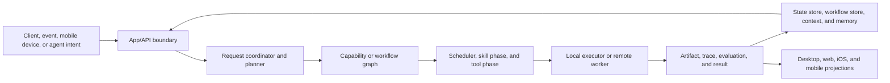

# SpiritKin Architecture Audit Scope

This repository is a review-only snapshot of the SpiritKinAI architecture. It
preserves executable source, contracts, configuration, tests, and design
documents while excluding runtime data, secrets, build output, local models,
toolchains, and large visual assets.

## Snapshot

- Source repository: `KnightOfSky/SpiritKinAI`
- Source branch: `codex/project-ui-governance`
- Source commit: `6d4cc5751b13ae5bfeb309fe4177f0c3be4cef91`
- Snapshot date: `2026-07-20`
- Audit repository history: intentionally squashed to one baseline commit

The source repository is not modified by this audit export.

## Included Surface

| Area | Primary paths | Review purpose |
| --- | --- | --- |
| Runtime and API | `backend/main.py`, `backend/app/` | Entrypoints, application assembly, command and realtime interfaces |
| Orchestration | `backend/orchestrator/` | Intent routing, planning, scheduling, task lifecycle, workflow execution |
| Agents | `backend/agents/`, `backend/prompts/` | Agent contracts, specialization, routing, context boundaries |
| Skills and tools | `backend/skills/`, `backend/tools/`, `backend/executors/` | Capability implementation, authorization, local and remote execution |
| Workers | `backend/remote/`, `scripts/control_plane_worker.py`, `scripts/runtime_host.py` | Worker protocol, heartbeat, package validation, execution isolation |
| Storage and memory | `backend/state_store.py`, `backend/memory/`, `backend/knowledge/` | Durable state, workflow persistence, context, knowledge and recovery |
| Governance and security | `backend/security/`, `backend/capability/growth/`, `backend/app/review_gate.py` | Permissions, review gates, sandboxing, promotion and safety controls |
| Clients | `desktop/`, `frontend/`, `ios/`, `mobile-link-bridge/`, `browser-extension/` | Runtime consumers and cross-device control surfaces |
| Deployment | `config/`, `deploy/`, `Dockerfile*`, `docker-compose.yml` | Service topology, environment contracts and production assumptions |
| Verification | `backend/tests/`, `tests/`, `.github/workflows/` | Architectural invariants and regression coverage |
| Architecture docs | `docs/` | Intended model, current plans, operations and design decisions |

## Excluded Surface

- `.env`, `.env.cloud`, credentials, signing material and user data
- `state/`, `runtime/`, logs, queues, databases, browser profiles and captures
- local model weights and generated media
- `.venv/`, Android SDKs, caches, `node_modules/`, build and distribution output
- binary fonts, 3D reference models and design-review screenshots
- unrelated temporary/reference repositories and archives

Secret scanning uses the default Gitleaks rules. `.gitleaks.toml` contains one
narrow allowlist entry for the literal browser storage key
`spiritkin_ios_capabilities_v1`, which the generic API-key rule otherwise
misclassifies; it is not a credential.

## Runtime Data Flow

The intended kernel model is documented in
`docs/ai_runtime_kernel_spec.md`. Review the code against that document, but
treat code behavior as the source of truth when they disagree.

## Priority Review Questions

1. Can a remote worker operate independently of the local desktop process, or
   do filesystem, process, callback, or state assumptions still bind it to the
   local machine?
2. Are registration, heartbeat, task claiming, leases, retries, cancellation,
   idempotency and disconnect recovery sufficient for at-least-once delivery?
3. Are task, workflow and node state transitions durable and internally
   consistent across crashes, concurrent hosts and replay?
4. Is the split between Intent, Planner, Workflow, Skill, Tool, Worker and Agent
   coherent in code, or are responsibilities duplicated across routers and
   managers?
5. Can local JSON/file persistence safely evolve toward shared or remote
   storage without breaking contracts? Check atomicity, locking, corruption,
   schema migration and ownership boundaries.
6. Are authentication, authorization, CORS/local bypasses, package signing,
   sandbox boundaries and secret references safe for remote deployment?
7. Do deployment files match runtime assumptions for storage, network reach,
   health checks, identity and artifact handling?
8. Which architectural risks are untested, and which tests assert implementation
   details instead of stable contracts?

## Suggested Review Output

Ask the reviewer to produce findings first, ordered by severity, with exact
file and line references. Each finding should include impact, evidence, a
concrete remediation direction and the missing regression test. Then request:

- a module dependency and ownership assessment;
- a remote-worker independence verdict;
- a task/workflow state-machine assessment;
- a storage and data-flow assessment;
- a prioritized remediation plan split into immediate, near-term and structural work.

Do not spend review time on visual polish unless a client implementation leaks
runtime responsibilities or violates an API contract.

## Review Phases

### Phase 1: Understand

- Describe the architecture that actually exists in code.
- Compare actual implementation with the documented kernel model.
- Classify modules as mature, partial, compatibility-only, or reserved.
- Do not propose code changes until this model is established.

### Phase 2: Identify Risk

- Module coupling and ownership leaks
- Data flow and persistence integrity
- Permission and trust boundaries
- Desktop, web, iOS, Android and worker relationships
- Remote Worker isolation and failure recovery
- Workflow lifecycle and replay behavior
- Agent and AI Employee governance

### Phase 3: Evaluate Direction

Evaluate whether current contracts support:

1. API plus independent Remote Worker
2. Self-hosted Model Service
3. Model Pool plus Multi-Tenant infrastructure

The owner constraints behind this direction are recorded in
`docs/decisions.md`.
