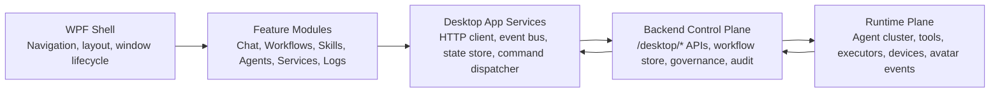

# SpiritKinAI Desktop Enterprise Architecture Plan

Last updated: 2026-06-10

## Purpose

This plan turns the current native desktop console into a maintainable enterprise operator platform. It focuses on four outcomes:

- Keep the desktop usable as features grow.
- Make workflow editing closer to mature node tools such as UE Blueprint, without losing the current Agent/workflow semantics.
- Improve performance by reducing full UI redraws and repeated backend polling.
- Separate governance, observability, execution, and UI concerns so risky actions stay auditable.

## Current Diagnosis

The desktop application is already functionally broad, but the implementation is still shaped like a fast-moving prototype:

| Area | Current state | Enterprise risk |
| --- | --- | --- |
| WPF shell | `desktop/SpiritKinDesktop/MainWindow.xaml.cs` is about 18,198 lines. | UI, API calls, state sync, workflow editor, terminal, and view models are tightly coupled. |
| XAML | `MainWindow.xaml` is about 4,115 lines. | Feature layout changes are hard to isolate and review. |
| Backend gateway | `backend/app/command_gateway.py` is about 1,052 lines. | Route registration is explicit but centralized; new modules keep growing the gateway. |
| Workflow management | `backend/app/workflow_management.py` is about 825 lines. | Workflow snapshot, governance, progress, node details, and actions are coupled in one module. |
| Workflow canvas | Supports nodes, ports, drag connection, green/red compatibility feedback, zoom, pan, multi-select, undo/redo, lanes, audit/version metadata. | Port semantics are still lightweight. Runtime connections remain primarily `depends_on`, not full typed dataflow. |
| Performance | Many paths call `RenderState`, `RenderWorkflowGraph`, and HTTP refresh methods directly. | Large pages can redraw too often; drag/edit operations risk jank as data grows. |

Strengths worth preserving:

- Backend management modules already expose stable `/desktop/*` boundaries.
- Review gates, audit events, workflow version history, and module governance exist.
- The launcher already handles stale services and WPF rebuild/restart behavior.
- The WPF UI has real operational breadth: chat, terminal, workflows, services, logs, diagnostics, learning, Skills, Agents, Search/RAG, governance, and 3D avatar.

## Target Architecture

The desired shape is a desktop shell plus independently testable feature modules:



### Frontend Layers

| Layer | Responsibility | Example target files |
| --- | --- | --- |
| Shell | Window chrome, navigation, top-level regions, lifecycle, global shortcuts. | `Shell/MainWindow.xaml`, `Shell/MainWindow.xaml.cs` |
| Feature views | One view per management surface. No direct HTTP calls. | `Features/Workflows/WorkflowPage.xaml` |
| View models | State, commands, validation, selection. No WPF visual-tree scanning except view-specific helpers. | `Features/Workflows/WorkflowPageViewModel.cs` |
| App services | HTTP gateway client, realtime event client, desktop state store, command bus, telemetry. | `Services/DesktopApiClient.cs` |
| Domain models | Typed snapshots and payloads shared by feature view models. | `Domain/Workflows/*.cs` |
| Infrastructure | ConPTY terminal, WebView2 avatar host, file/log readers. | `Infrastructure/Terminal/*` |

Rules:

- Views bind to view models; view models call app services.
- App services own JSON/HTTP/event parsing.
- Feature modules never directly mutate another module's controls.
- Cross-module actions go through a command bus or navigation service.
- Risky execution actions must carry audit metadata and review-gate state.

### Backend Layers

| Layer | Responsibility |
| --- | --- |
| Gateway/router | Request parsing, auth/token policy, endpoint dispatch only. |
| Desktop application services | Module-specific use cases such as `WorkflowManagementService`, `SkillManagementService`, `AgentManagementService`. |
| Domain | Workflow definitions, node schemas, permission policies, audit events, task queues. |
| Infrastructure | JSON stores, filesystem logs, process/service control, model provider clients. |

The gateway should become a thin route table. Module files should own actions, validation, and snapshots.

## Workflow Editor Evolution

Current workflow editing is a good first professional pass, but the next enterprise-grade layer should make ports first-class.

### Current Behavior

- Users drag from an output port to an input port.
- Compatible targets turn green; incompatible targets turn red.
- Incompatible drops show a reason in the action text and designer validation text.
- Self-links and dependency cycles are blocked.
- Saved metadata includes port descriptors and `connection_policy`.
- Runtime semantics still use `depends_on`.

### Target UE-Style Model

Move from "node depends on node" to "pin connects to pin", while still deriving `depends_on` for scheduler compatibility.

| Concept | Target behavior |
| --- | --- |
| Execution pins | White/control pins represent execution order. |
| Data pins | Colored pins represent typed data, such as `artifact.product_data`, `image.asset`, `review.decision`, `signal.event`. |
| Pin compatibility | Connections validate exact type, compatible family, or explicit coercion rule. |
| Edge model | Store `source_node`, `source_pin`, `target_node`, `target_pin`, `edge_kind`, and optional schema mapping. |
| Scheduler bridge | Generate `depends_on` from execution/data dependencies for the existing workflow runner. |
| Error display | Invalid edges remain visible as dashed red edges until fixed or deleted, instead of only showing a text warning. |

### Pin Type Rules

Recommended initial pin families:

| Family | Examples | Notes |
| --- | --- | --- |
| `exec` | `exec.in`, `exec.out` | Controls scheduling. |
| `artifact` | `artifact.product_data`, `artifact.image`, `artifact.document` | Represents durable outputs. |
| `knowledge` | `knowledge.query`, `knowledge.context` | Search/RAG context flow. |
| `review` | `review.request`, `review.decision` | Governance and approval gates. |
| `signal` | `signal.event`, `signal.callback` | Waiters and external callbacks. |
| `agent` | `agent.task`, `agent.result` | Agent assignment and task result flow. |

Compatibility should be explicit:

- Same exact type connects by default.
- Same family can connect only when a coercion rule exists.
- `exec` pins cannot connect to data pins.
- Review decision pins should connect only to gates, branches, or approved execution continuations.
- Unknown pins are visible but blocked by default unless a policy marks them permissive.

## Error And Governance UX

Enterprise workflow tooling needs visible, actionable failures:

- Add an "Issues" strip above the canvas with counts for invalid edges, missing required fields, cycles, permission failures, and stale versions.
- Render invalid edges as dashed red paths with a tooltip.
- Render node error badges with click-to-focus behavior.
- Add "Fix" actions where safe: remove invalid edge, open node inspector, select missing Agent, create review gate, retry failed node.
- Keep the existing suggestion-first repair policy; do not auto-modify risky workflows without explicit user action.
- Add audit preview before save: definition diff, schema issues, permission policy, and expected reviewer requirements.

## Desktop Performance Plan

### UI Rendering

| Problem | Fix |
| --- | --- |
| `RenderState` refreshes broad UI regions. | Split into feature-specific render paths and eventually view-model property notifications. |
| `RenderWorkflowGraph` rebuilds graph visuals during drag/edit. | Separate graph data rebuild from selection/hover/preview updates. |
| Drag operations call preview/render paths frequently. | Throttle drag updates to 60 fps or less with a `DispatcherTimer`/dirty flag. |
| Brushes and geometries are recreated often. | Cache static brushes, converters, and reusable geometry builders. |
| Large lists can become expensive. | Keep virtualization enabled; avoid wrapping virtualized lists in unconstrained `ScrollViewer`; use paging/filtering for logs and events. |

### Backend And Data

| Problem | Fix |
| --- | --- |
| Multiple panels refresh independently. | Add a desktop snapshot cache with module-level ETags/revisions. |
| Polling can happen even when a panel is hidden. | Refresh only visible/active modules; use realtime events for invalidation. |
| JSON parsing is spread through WPF code. | Move parsing into typed DTOs and app services. |
| Logs and diffs can be large. | Page logs/diffs and stream tails instead of loading full payloads into controls. |

### Avatar And WebView2

- Pause or lower avatar update frequency when the 3D panel is hidden.
- Keep runtime events flowing, but avoid WebView2 post-message calls when the view is not initialized or visible.
- Keep the floating avatar and embedded avatar from both receiving duplicate expensive updates unless both are visible.

## Incremental Refactor Sequence

Do not rewrite the desktop in one pass. Use a strangler pattern.

### Phase 1: Stabilize Boundaries

1. Add `DesktopApiClient` for all `/desktop/*` calls.
2. Add typed DTOs for workflow snapshots, services, logs, Skills, Agents, and module management.
3. Move reusable color/status/port rules out of `MainWindow.xaml.cs`.
4. Add a simple in-process event bus for cross-feature notifications.
5. Keep `MainWindow` behavior identical during extraction.

Exit criteria:

- WPF build passes.
- Existing workflow, services, Skills, Agents, and logs still load.
- No feature view has to parse raw `JsonElement` directly after it has a DTO.

### Phase 2: Extract Workflows First

1. Create `Features/Workflows`.
2. Move workflow view models, lane layout, connection rules, graph node/edge models, and inspector logic.
3. Keep the XAML region initially hosted inside the old window if a full page extraction is too large.
4. Add unit tests for pin compatibility, cycle blocking, and DTO parsing.
5. Add UI telemetry counters for graph rebuilds and drag-frame updates.

Exit criteria:

- Workflow graph selection/drag/connect/undo/redo still works.
- Invalid connections show canvas-level errors.
- Large workflow smoke test with 100 nodes remains responsive.

### Phase 3: Typed Pins And Schema Forms

1. Add backend workflow edge schema: `edges[]` with pin ids.
2. Preserve `depends_on` as generated compatibility output.
3. Add node type schemas with required inputs, outputs, and argument forms.
4. Add migration for old definitions that only have `depends_on`.
5. Add tests for old definition compatibility.

Exit criteria:

- Old workflows still run.
- New workflows can use multiple typed pins per node.
- Invalid typed edges are visible and blocked from save/run.

### Phase 4: Split Management Modules

Extract in this order:

1. Services, logs, diagnostics.
2. Skills.
3. Agent management.
4. Search/RAG and models.
5. Learning/evolution/governance.
6. Chat/composer/terminal after shared services are stable.

These modules are simpler than workflows and will benefit from the app-service and DTO foundation.

### Phase 5: Enterprise Governance

1. Add role-aware permission policies for workflow save, run, rollback, Skill promotion, remote export, and service restart.
2. Add audit queries and filters in the desktop.
3. Add approval queue ownership and SLA fields.
4. Add signed export packages for remote workers.
5. Add environment profiles: local dev, operator workstation, remote worker, demo.

## Verification Matrix

Minimum checks after each architecture slice:

```powershell
dotnet build desktop\SpiritKinDesktop\SpiritKinDesktop.csproj -p:UseAppHost=false -p:OutDir=D:\SpiritKinAI\tmp\wpf-build\
python -m unittest backend.tests.unit.test_workflow_graph backend.tests.unit.test_command_gateway -v
python -m py_compile backend\app\command_gateway.py backend\app\workflow_management.py scripts\start_desktop_console.py
git diff --check
```

Workflow-specific checks:

- Create workflow.
- Add Agent, Tool, Skill, Gate, Branch, Waiter, Callback, and Subgraph nodes.
- Drag nodes across lanes and verify lane clamping.
- Connect compatible pins and save.
- Attempt incompatible pin connection and confirm red edge/error message.
- Attempt a cycle and confirm it is rejected.
- Roll back definition version.
- Start run and inspect node progress, queue, Skill map, and repair suggestions.

Performance checks:

- Open Workflows with 100 nodes and 150 edges.
- Drag one node for 10 seconds; UI should not freeze.
- Rubber-band select 30 nodes; selection should update without graph rebuild flicker.
- Open Logs with large files; initial view should stay responsive.
- Hide 3D avatar panel; WebView2 event posting should stop or drop to minimal updates.

## Implemented Slices

### 2026-06-10 Module Management V2

The first enterprise module-management slice is now implemented:

- `backend/app/module_management.py` now emits `spiritkin.module_management.v2`.
- The module snapshot includes portfolio health, readiness percent, risk counts, high/medium/low action counts, operator posture, owner role, management group, criticality, maturity, SLA, governance state, risk summary, and health score.
- Module action items now include module label, owner role, management group, risk level, criticality, SLA, governance state, and operator hint.
- WPF Modules was renamed visually to enterprise module portfolio management. It now has three top summary panels for portfolio health, risk queue, and governance posture.
- WPF module cards now show health score, owner/SLA, business capability, criticality, maturity, risk, governance state, and action counts.
- WPF governance action cards now show priority, module, owner/risk/SLA metadata, detail, and operator hint.

Remaining module-management work:

- Add role-aware permissions and audit filters to module actions.
- Add environment grouping for local workstation, remote worker, and demo profiles.
- Add module release/version status and rollback signals.
- Split the WPF Modules page into a dedicated feature module after shared `DesktopApiClient` and DTO extraction exist.

## Near-Term Implementation Recommendation

The highest-value next engineering slice is:

1. Extract workflow connection rules and graph DTOs from `MainWindow.xaml.cs`.
2. Add first-class `WorkflowPin` and `WorkflowEdge` domain models.
3. Keep saving `depends_on` for compatibility, but start rendering/editing from `edges`.
4. Add canvas-level issue list and invalid-edge rendering.
5. Add graph render throttling during drag/connect preview.

This gives visible UI improvement, improves architecture, and creates the path toward true UE-style typed workflow pins without breaking current workflow execution.
